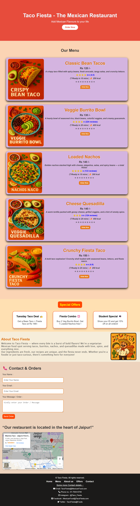

 # Taco Fiesta - The Mexican Restaurant 🏩

This website is created as a mini challenge , using HTML & CSS.

## 🌐Live Link : 
[Click to View Taco Fiesta Website](https://codebygunjan.github.io/Taco-Fiesta-food-website/)

## 💻 Features

- Responsive design (mobile-friendly)
- Bold and vibrant color palette
- Tasty layout with AI-generated food images 🍽️
- Creative header and footer
- Clean, well-structured HTML and CSS

## 💥Skills Used : 

- HTML5
- CSS3
- Media Queries
- GitHub
- FlexBox
- Animations

## 📷 Preview : 

## ✍️ Author

**👩 Gunjan Harkesh Khudaniya**  
Beginner Web Developer | Creative Coder | Passionate Learner  
📍 [GitHub: @codebygunjan](https://github.com/codebygunjan)

---

✨ _“Learning one project at a time – this is my journey to becoming a Full Stack Developer!”_